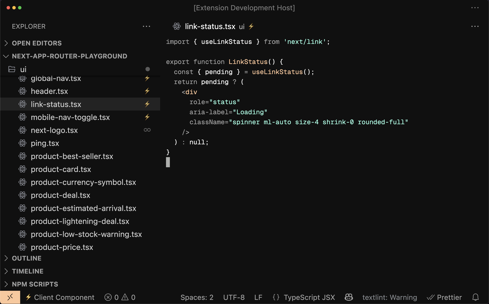
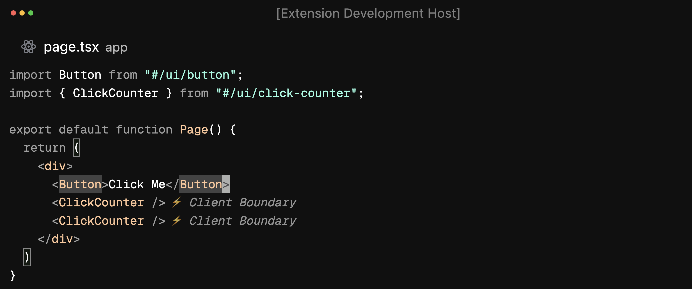

# Next.js Component Boundary Visualizer

> Visualizes server, client, and universal components with explorer badges, status bar indicators, editor decorations, and JSX client boundary markers in Next.js App Router projects.

## Screenshots

### Explorer Badges and Status Bar



### JSX Client Boundary Markers

## 

**Extension ID:** `vscode-nextjs-component-boundary-visualizer`

You can install this extension by searching for "Next.js Component Boundary Visualizer" or using the extension ID above in the VS Code Extensions view.

---

## Features

- **High‑precision static analysis**: Infers server, client, and universal(shared) components using the TypeScript type checker and a dependency graph.
- **Explorer Badges**: Shows icons for client(⚡️) and universal(♾️) components in the file explorer.
- **Status Bar**: Displays the type of the currently open component (client, server, universal).
- **JSX Client Boundary Markers**: shows a subdued end‑of‑line indicator (⚡️) on lines that render Client Components across a boundary.
- **Line Decorations**: Adds a colored line and icon to the editor for client and universal components.
- **Automatic Updates**: Watches for file changes and updates the visualization in real time.

## Requirements

- VS Code 1.100.0 or later
- A Next.js project using the App Router (TypeScript projects are supported; all `.ts` and `.tsx` files are analyzed for component boundaries, except for config, d.ts, test, spec, stories, and `__mocks__` files)
- A `tsconfig.json` file must exist at the project root (or specify its path via extension settings)

## Usage

Open a Next.js App Router project in VS Code. The extension will automatically analyze your files and display component type information in the explorer, status bar, and editor.

If your `tsconfig.json` is not at the project root, set the path in your VS Code settings:

```json
"nextjsComponentBoundaryVisualizer.tsconfigPath": "path/to/your/tsconfig.json"
```

## Extension Settings

- `nextjsComponentBoundaryVisualizer.tsconfigPath`: Path to `tsconfig.json` (absolute or workspace-relative). If empty, `<project root>/tsconfig.json` is used.
- `nextjsComponentBoundaryVisualizer.enableLineIcon`: Enable/disable the icon at the beginning of the line. Defaults to false.
  - Note: The JSX Client Boundary end‑of‑line indicator is always shown when applicable.
- `nextjsComponentBoundaryVisualizer.exclude`: List of glob patterns to exclude files or directories from analysis and decorations. Patterns are workspace‑relative.
  - Examples:
    ```json
    {
      "nextjsComponentBoundaryVisualizer.exclude": [
        "**/*.want-to-exclude.tsx",
        "packages/ui/src/want-to-exclude/**"
      ]
    }
    ```
  - Note: Some files are excluded by default (e.g., config files, `*.d.ts`, tests, specs, stories, and `__mocks__`). Use this setting to add additional project‑specific exclusions.

## Icons

- **Client Component**: `⚡️`
- **Universal Component**: `♾️`
- **Server Component**: No icon (server components do not display a badge or icon)

These icons appear in the file explorer, status bar, and as line decorations in the editor to help you quickly distinguish component types. Note: visual decorations are applied only to `.tsx` files (component files). Plain `.ts` files are analyzed for dependency/type classification but are not decorated.

## Known Issues

- Only supports projects using the App Router structure.
- Does not support legacy Next.js pages directory.
- Only `.ts` and `.tsx` files are analyzed for component boundaries (excluding config, d.ts, test, spec, stories, and `__mocks__` files; `.js`/`.jsx` are not supported).
- Visual decorations (explorer badges, status bar, line icons, and JSX Client Boundary markers) are shown only for `.tsx` files. `.ts` files are excluded from icon display because they are not React component files.
- The extension will not work if `tsconfig.json` is missing or misconfigured.
- Does not analyze dynamic imports; only static imports and re-exports are considered for dependency graph and component type classification.

## Related Extensions

- [Next.js Server Functions Visualizer](https://marketplace.visualstudio.com/items?itemName=makotot.nextjs-server-functions-visualizer)
- [Next.js RSC Boundary Pack](https://marketplace.visualstudio.com/items?itemName=makotot.nextjs-rsc-boundary-pack)
